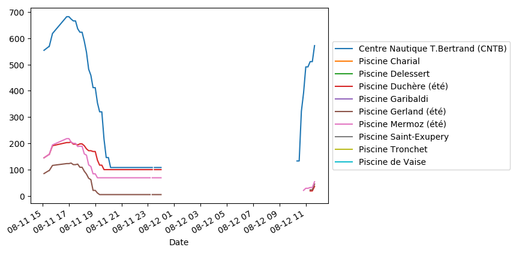

# Piscines de Lyon

Télécharge les données de fréquentation des piscines de Lyon et les affiche sous forme de graphique.

## Téléchargement des données

Les données historiques ne semblent pas mises à disposition, il faut donc télécharger les données actuelles à intervalle régulier.

**Prérequis :**  curl, awk, [pup](https://github.com/ericchiang/pup)

Ajouter le script de téléchargement au crontab:

     */15 * * * * $HOME/projets/piscines/download.sh >> $HOME/projets/piscines/data.tsv

## Création du graphique

**Prérequis :**  pandas, scipy, matplotlib

    python graph.py

